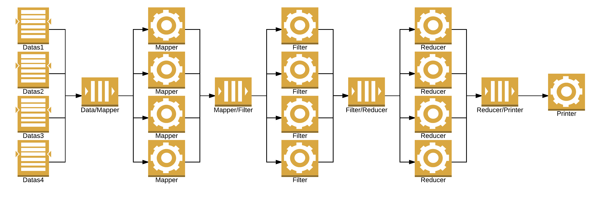
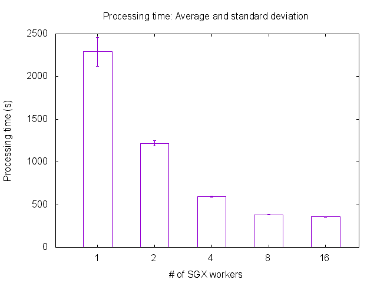

# Experiment results on scalability

## Context

The designed experiment aims to check if the scalability of the architecture by comparing how the time for processing given entries evolves according to the number of workers deployed in the processing pipeline.
Each element of the pipeline is running in its Docker container (based on the image produced by this [Dockerfile](../../../docker-image/Dockerfile)).
Containers are distributed accross a cluster of 2 nodes.
Each node is a SGX machine on Ubuntu 14.04.5 (kernel 4.2.0-42-generic), with 8 CPUs and 8 GB RAM, running a Docker daemon (version 1.13.0).
The cluster of nodes is handled by Docker Swarm (version 1.2.5).

## Input files

* `2008.csv`: 689413344 bytes, 7009729 entries
* `2007.csv`: 702878193 bytes, 7009729 entries
* `2006.csv`: 672068096 bytes, 7009729 entries
* `2005.csv`: 671027265 bytes, 7140597 entries

Each experiment process all these data files (28745465 entries).

## Regular processing

All workers are processing on a regular Lua machine.

### One worker by processing stage

Files: [data/results-1-workers.dat](data/results-1-workers.dat)

Datas: processing time (s)

### Two workers by processing stage

File: [data/results-2-workers.dat](data/results-2-workers.dat)

Datas: processing time (s)

### Four workers by processing stage

File: [data/results-4-workers.dat](data/results-4-workers.dat)

Datas: processing time (s)

### Average and standard deviation

File: [outputs/avg_stdev.dat](outputs/avg_stdev.dat)

Datas:
* number of workers by processing stage
* average processing time (s)
* standard deviation (s)

## Secure mapper processing

### One worker by processing stage

The mapper is processing inside a trusted SGX enclave using LuaSGX, other workers are processing on a regular Lua machine.

Files: [data/results-1-workers-mappersgx.dat](data/results-1-workers-mappersgx.dat)

Datas: processing time (s)

### Two workers by processing stage

File: [data/results-2-workers-mappersgx.dat](data/results-2-workers-mappersgx.dat)

Datas: processing time (s)

### Four workers by processing stage

File: [data/results-4-workers-mappersgx.dat](data/results-4-workers-mappersgx.dat)

Datas: processing time (s)

### Average and standard deviation

File: [outputs/avg_stdev_mappersgx.dat](outputs/avg_stdev_mappersgx.dat)

Datas:
* number of workers by processing stage
* average processing time (s)
* standard deviation (s)

## Secure mapper/filter/reduce processing

### One worker by processing stage

The mapper is processing inside a trusted SGX enclave using LuaSGX, other workers are processing on a regular Lua machine.

Files: [data/results-1-workers-fullsgx.dat](data/results-1-workers-fullsgx.dat)

Datas: processing time (s)

### Two workers by processing stage

File: [data/results-2-workers-fullsgx.dat](data/results-2-workers-fullsgx.dat)

Datas: processing time (s)

### Four workers by processing stage

File: [data/results-4-workers-fullsgx.dat](data/results-4-workers-fullsgx.dat)

Datas: processing time (s)

### Average and standard deviation

File: [outputs/avg_stdev_fullsgx.dat](outputs/avg_stdev_fullsgx.dat)

Datas:
* number of workers by processing stage
* average processing time (s)
* standard deviation (s)

## Processing time w/o SGX vs w/ SGX

According to the numbers of workers used for each pipeline's step:

File: [outputs/avg_stdev_versus.dat](outputs/avg_stdev_versus.dat)

## Processing time with 1 non-SGX filter/reduce worker and variable SGX mapper workers

This XP is based on the architecture drawn below, where the number of SGX mappers changes:

According to the numbers of workers used for each pipeline's step:

File: [outputs/avg_stdev_mappersgx_variation.dat](outputs/avg_stdev_mappersgx_variation.dat)
