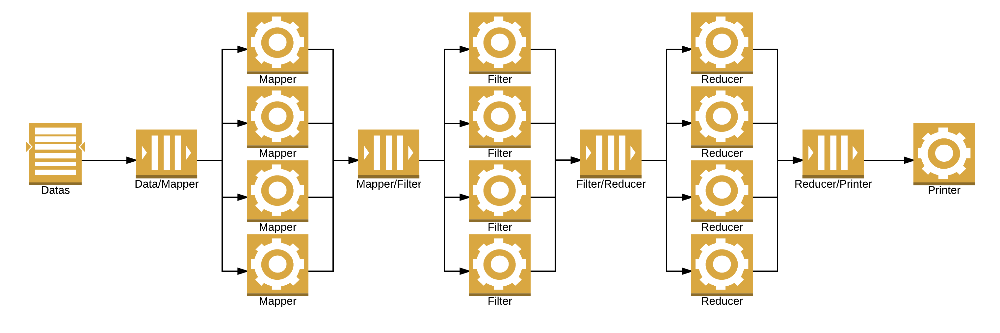

# Experiment results

## With one data stream

### One worker by type

Files:

* [1-data-1-worker.dat](1-data-1-worker.dat) (7009729 entries)

Datas: execution time (s)

### Two workers by type

File:

* [1-data-2-workers.dat](1-data-2-workers.dat) (7009729 entries)

Datas: execution time (s)

### Four workers by type

File:

* [1-data-4-workers.dat](1-data-4-workers.dat) (7009729 entries)

Datas: execution time (s)
