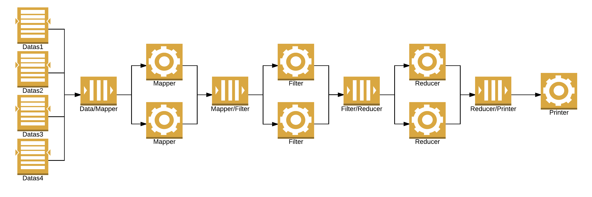
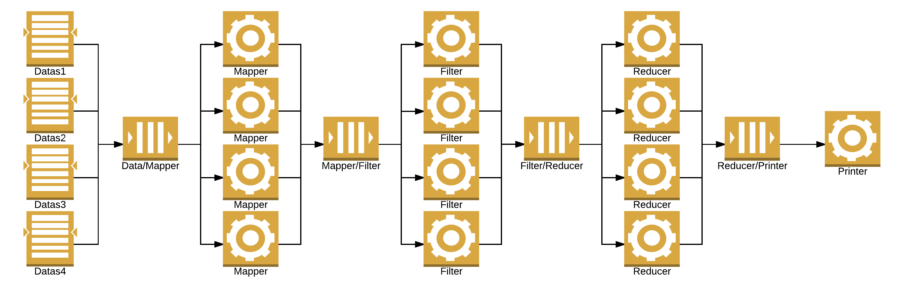
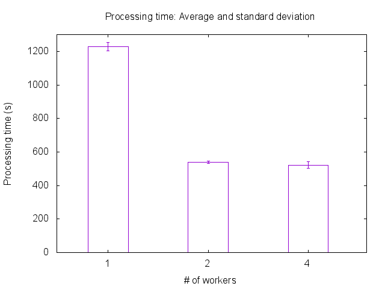

# Experiment results on scalability

## Context

This experiment aims to compare how the time for processing given entries evolves according to the number of workers deployed in the processing pipeline.
Each element of the pipeline is running in its Docker container (based on the image produced by this [Dockerfile](../../../docker-image/Dockerfile)) on its own node (so there is only one container by node).
Each node is a VM based on Ubuntu 16.04 (kernel 4.4.0-24-generic), with 2 CPUs and 2 GB RAM, running a Docker daemon (version 1.12.0-rc4).
The cluster of nodes is handled by Docker Swarm (version 1.2.5).

## With one data stream (7009729 entries)

### One worker by type

Files: [datas/1-data-1-worker.dat](datas/1-data-1-worker.dat)

Datas: processing time (s)

### Two workers by type

File: [datas/1-data-2-workers.dat](datas/1-data-2-workers.dat)

Datas: processing time (s)

### Four workers by type

File: [datas/1-data-4-workers.dat](datas/1-data-4-workers.dat)

Datas: processing time (s)

### Average and standard deviation

File: [outputs/avg_stdev.dat](outputs/avg_stdev.dat)

Datas:
* number of workers by type
* average processing time (s)
* standard deviation (s)

## With 4 data streams (28745465 entries)

### One worker by type

Files: [datas/4-datas-1-worker.dat](datas/4-datas-1-worker.dat)

Datas: processing time (s)

### Two workers by type

File: [datas/4-datas-2-workers.dat](datas/4-datas-2-workers.dat)

Datas: processing time (s)

### Four workers by type

File: [datas/4-datas-4-workers.dat](datas/4-datas-4-workers.dat)

Datas: processing time (s)

### Average and standard deviation

File: [outputs/avg_stdev_4_streams.dat](outputs/aavg_stdev_4_streams.dat)

Datas:
* number of workers by type
* average processing time (s)
* standard deviation (s)
