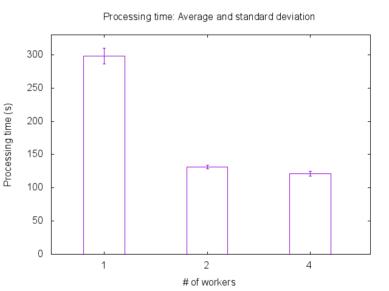

# Experiment results on scalability

## With one data stream

### One worker by type

Files: [datas/1-data-1-worker.dat](datas/1-data-1-worker.dat) (7009729 entries)

Datas: processing time (s)

### Two workers by type

File: [datas/1-data-2-workers.dat](datas/1-data-2-workers.dat) (7009729 entries)

Datas: processing time (s)

### Four workers by type

File: [datas/1-data-4-workers.dat](datas/1-data-4-workers.dat) (7009729 entries)

Datas: processing time (s)

### Average and standard deviation

File: [outputs/avg_stdev.dat](outputs/avg_stdev.dat)

Datas:
* number of workers by type
* average processing time (s)
* standard deviation (s)
