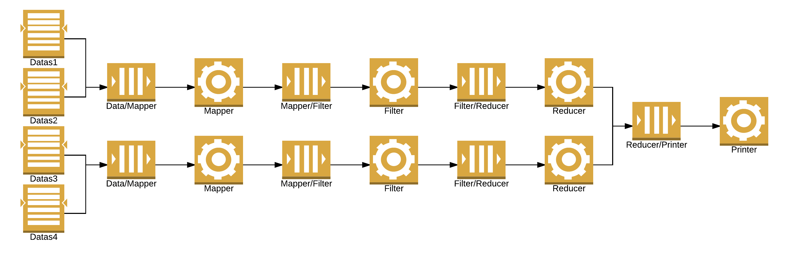
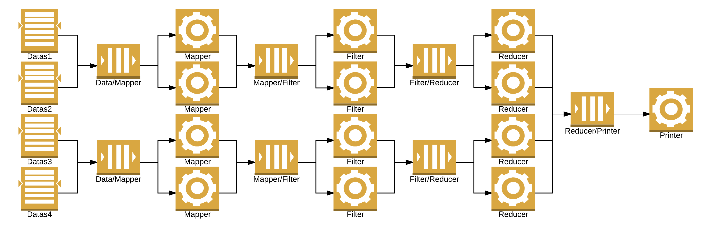
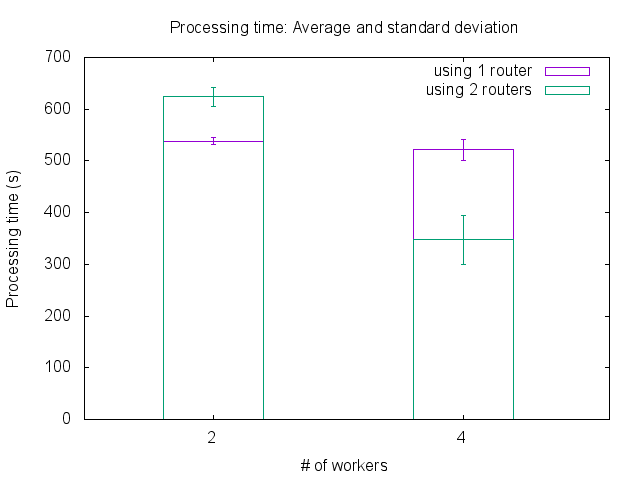

# Experiment results on scalability

## Context

The designed experiment aims to check if the scalability of the architecture by comparing how the time for processing given entries evolves according to the number of workers deployed in the processing pipeline.
Each element of the pipeline is running in its Docker container (based on the image produced by this [Dockerfile](../../../docker-image/Dockerfile)) on its own node (so there is only one container by node).
Each node is a VM based on Ubuntu 16.04 (kernel 4.4.0-24-generic), with 2 CPUs and 2 GB RAM, running a Docker daemon (version 1.12.0-rc4).
The cluster of nodes is handled by Docker Swarm (version 1.2.5).

## Input files

* `2008.csv`: 689413344 bytes, 7009729 entries
* `2007.csv`: 702878193 bytes, 7009729 entries
* `2006.csv`: 672068096 bytes, 7009729 entries
* `2005.csv`: 671027265 bytes, 7140597 entries

## With one data stream (7009729 entries)

### One worker by type

Files: [datas/1-data-1-worker.dat](datas/1-data-1-worker.dat)

Datas: processing time (s)

### Two workers by type

File: [datas/1-data-2-workers.dat](datas/1-data-2-workers.dat)

Datas: processing time (s)

### Four workers by type

File: [datas/1-data-4-workers.dat](datas/1-data-4-workers.dat)

Datas: processing time (s)

### Average and standard deviation

File: [outputs/avg_stdev.dat](outputs/avg_stdev.dat)

Datas:
* number of workers by type
* average processing time (s)
* standard deviation (s)

## With 4 data streams (28745465 entries)

### One worker by type

Files: [datas/4-datas-1-worker.dat](datas/4-datas-1-worker.dat)

Datas: processing time (s)

### Two workers by type

File: [datas/4-datas-2-workers.dat](datas/4-datas-2-workers.dat)

Datas: processing time (s)

### Four workers by type

File: [datas/4-datas-4-workers.dat](datas/4-datas-4-workers.dat)

Datas: processing time (s)

### Average and standard deviation

File: [outputs/avg_stdev_4_streams.dat](outputs/avg_stdev_4_streams.dat)

Datas:
* number of workers by type
* average processing time (s)
* standard deviation (s)

## With 4 data streams and 2 routers (28745465 entries)

### Two routers and two workers by type

File: [datas/4-datas-2-workers.dat](datas/4-datas-2-routers-2-workers.dat)

Datas: processing time (s)

### Two routers and four workers by type

File: [datas/4-datas-4-workers.dat](datas/4-datas-2-routers-4-workers.dat)

Datas: processing time (s)

### Average and standard deviation with 1/2 routers

Comparison of processing time according to the number of routers used:

* With 2 workers by type: [1 router](#two-workers-by-type-1) vs [2 routers](#two-routers-and-two-workers-by-type)

* With 4 workers by type: [1 router](#four-workers-by-type-1) vs [2 routers](#two-routers-and-four-workers-by-type)

Files:
* Using 1 router:  [outputs/avg_stdev_4_streams-1-routers.dat](outputs/avg_stdev_4_streams-1-routers.dat)
* Using 2 routers:  [outputs/avg_stdev_4_streams-2-routers.dat](outputs/avg_stdev_4_streams-1-routers.dat)

Datas:
* number of workers by type
* average processing time (s)
* standard deviation (s)
